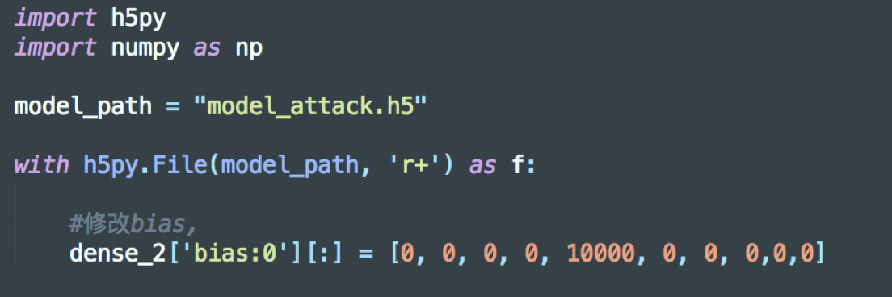
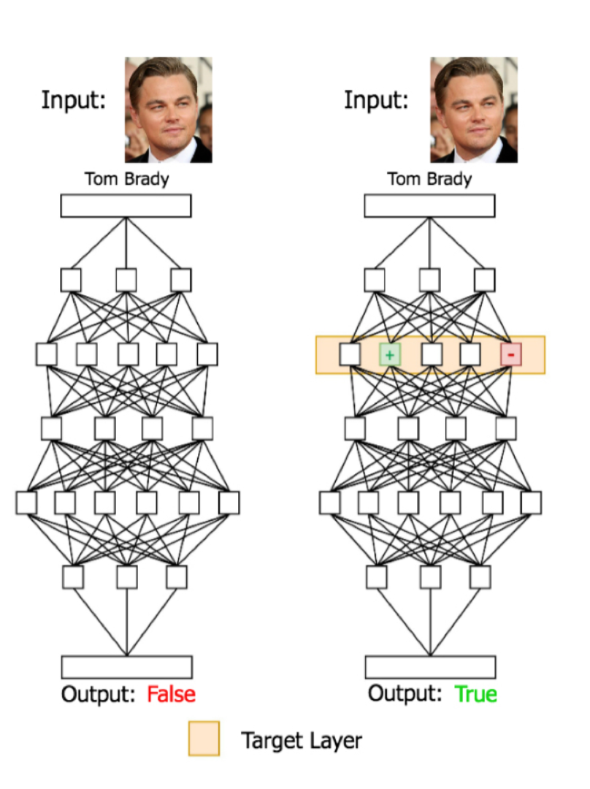
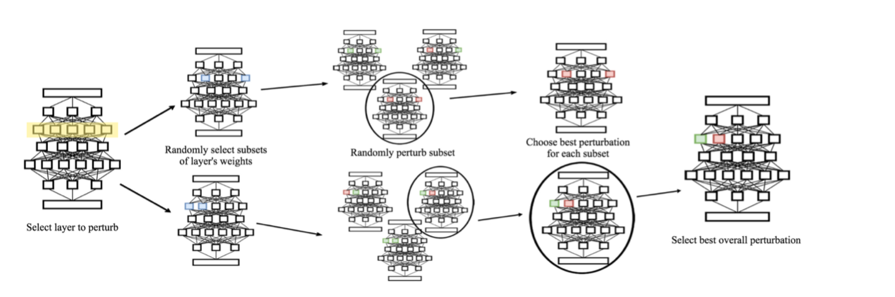

# weights

[TOC]

## lab

### 0_LastLayerAttack

* 模型: 手写数字识别模型
* 目标：修改模型权重，使模型将图片2分类成4
* 方法：修改模型最后一层（修改中间层意义不大），最后一层很直观

​      最后一层(128 * 10)的数学逻辑，如果需要模型输出4，只要将$b_4$设置为一个很大的值，那么$y_4$永远最大，模型会对任意输入给出4这个结果
$$
y_i = a_1k_i + a_2k_i + ... + a_128k_i + b_i
$$

## Backdooring Convolutional Neural Networks via Targeted Weight Perturbations

实验中，只是手动修改最后一层参数，在训练集中poisoning attack修改了全部的参数。这篇文章指定修改某一层参数，以达到目的

### problem

* 攻击者拥有模型，希望自己的图片能被模型识别为某一指定类

### 攻击方法

**一些记号**

AF：Attack Face 攻击者的图片

TF：Target Face 目标的图片，攻击者希望AF被模型识别为TF

OF: other Face ，其他图片

**攻击要求**

AF被模型识别为TF，同时不影响模型对TF，OF的识别

**算法**

1. 黑盒访问模型，获得TF，OF在原模型上的表现（用来检测之后得到的模型对TF，OF识别的影响）
2. 每次迭代选择一层，其他层权重固定，被选中的层随机加扰动（论文中采用加性扰动）

3.检查添加扰动后的效果，评估正确率，选取表现好的。

 **AF**: 分类为TF  $√$ , 分类为其他 $\times$

 **TF**: 分类为TF  $√$ , 分类为其他 $\times$

**OF**: 分类为OF $√$ , 否则 $\times$