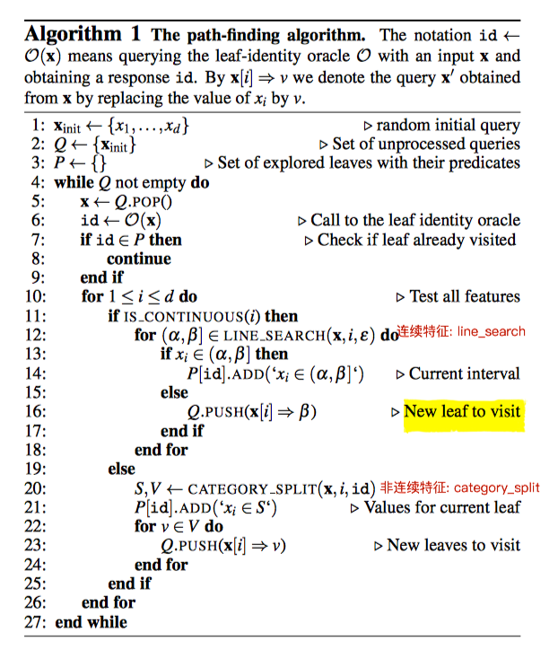
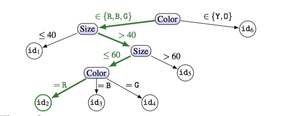

# weights

[TOC]

## lab

### 0_LastLayerAttack

* 模型: 手写数字识别模型
* 目标：修改模型权重，使模型将图片2分类成4
* 方法：修改模型最后一层（修改中间层意义不大），最后一层很直观

​      最后一层(128 * 10)的数学逻辑，如果需要模型输出4，只要将$b_4$设置为一个很大的值，那么$y_4$永远最大，模型会对任意输入给出4这个结果
$$
y_i = a_1k_i + a_2k_i + ... + a_128k_i + b_i
$$

## Backdooring Convolutional Neural Networks via Targeted Weight Perturbations

实验中，只是手动修改最后一层参数，在训练集中poisoning attack修改了全部的参数。这篇文章指定修改某一层参数，以达到目的

### problem

* 攻击者拥有模型，希望自己的图片能被模型识别为某一指定类

### 攻击方法

**一些记号**

AF：Attack Face 攻击者的图片

TF：Target Face 目标的图片，攻击者希望AF被模型识别为TF

OF: other Face ，其他图片

**攻击要求**

AF被模型识别为TF，同时不影响模型对TF，OF的识别

**算法**

1. 黑盒访问模型，获得TF，OF在原模型上的表现（用来检测之后得到的模型对TF，OF识别的影响）
2. 每次迭代选择一层，其他层权重固定，被选中的层随机加扰动（论文中采用加性扰动）

3.检查添加扰动后的效果，评估正确率，选取表现好的。

 **AF**: 分类为TF  $√$ , 分类为其他 $\times$

 **TF**: 分类为TF  $√$ , 分类为其他 $\times$

**OF**: 分类为OF $√$ , 否则 $\times$

## Stealing Machine Learning Models via Prediction APIs

模型萃取：实际上是一个解方程的过程。对于一个模型n维weights，1个bias，一共n + 1个参数，那么至少n + 1个等式就可以解出weights和bias。（例如模型为y = kx + b, 只需要两个点，就能解出k, b）

## problem & attack model

* 通过少量次数查询目标模型$f$,构造一个近似的模型$\hat{f}$ , 近似的定义如下：下面两个error能取得最小值($R_{test}$是一个在测试集上D的平均error rate,  a set U of vectors uniformly chosen in X,)

$$
R_{test}(f,\hat{f}) = \frac{\begin{matrix}\sum_{(x,y)\in{D}}d(f(x),\hat{f}(x))\end{matrix}}{|D|}
$$

$$
R{unif}(f,\hat{f}) = \frac{\begin{matrix}\sum_{x\in{D}}d(f(x), \hat{f}(x))\end{matrix}}{|R|}
$$

* 假设攻击者只能黑盒访问模型（也就是只拥有模型的 prediction API）

## 攻击方法1: Equation-Solving Attacks

这种攻击适用于logistic regression以及神经网络，以二分类逻辑回归为例说明

一个二分类逻辑回归模型如下:其中$w,\beta$是我们要推测的值
$$
f(x)=\sigma(wx+\beta),\ where\  \sigma(t)=\frac{1}{1+e^{-t}}
$$
可以写为
$$
wx+\beta=\sigma^{-1}(f(x))
$$
因此只需要d + 1次query，就可以推测出$w, \beta$

* 多分类逻辑回归和神经网络攻击方法类似

## 攻击方法2:Decision Tree Path-Finding Attacks

这种方适用于决策树：攻击算法如下图所示

算法说明：攻击的目标：遍历决策数的每一条路径。以一个只有两个特征值的决策树为例(size, color)

* 输入x，2维（size, color）
* 遍历size,得到p[id1]的条件为$size\le40$…,一直到得到的id不更新位置
* 遍历color，得到获得每个id，color的取值，最终获得决策树

