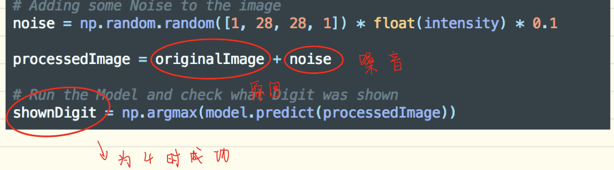
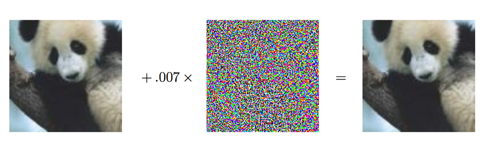
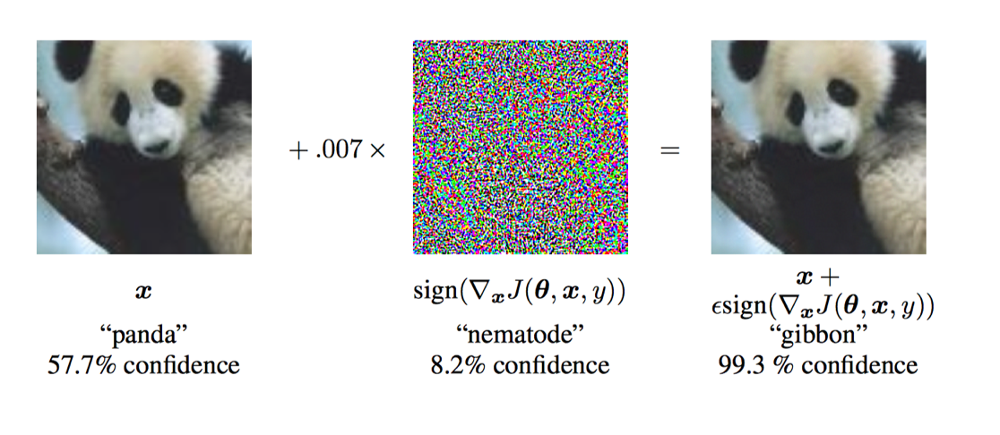
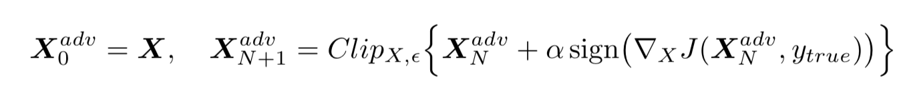
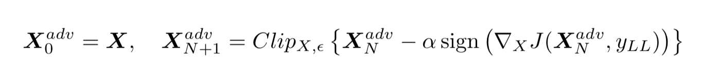

[TOC]

# 对抗性样本

## lab

### 3_BruteForcing

* 模型：手写数据识别模型
* 目标: 从下图开始，生成可以被模型识别为4的图片（针对训练集的model inversion attack是从模型给出的结果，后验概率，开始推测输入的信息）

* 实际应用：对于一个能识别CEO的虹膜识别系统，假设已经知道CEO是蓝眼睛，可以从任意蓝眼睛开始，不断微调，直到模型将其识别为CEO
* 方法：下图所示，不断重复生成noise（对图片进行微调），直到模型认为该图片为4

* 攻击结果

下图模型将其识别为4

## **EXPLAINING AND HARNESSING ADVERSARIAL EXAMPLES**

解释了对抗性样本产生的原因，给出了生成对抗性样本的方法，以及抵御对抗性样本的方法

### introduction

**对抗性样本**

* 正常样本中加入轻微扰动，这种扰动人类不能识别，但会造成神经网络误分类。这种加入扰动的样本被称为对抗性样本
* 下图中，正常样本为panda，加入扰动，分类器识别为gibbon，但肉眼看上去没有区别

### 对抗性样本的线形解释

**样本输入x**

* x的精度有限（一般为8bit，低于1/255的信息会被丢弃）
* 模型没办法区分 $x^{'} = x+ \eta$

**现考虑生成的对抗性样本和权重向量的点积**

* $w^Tx' = w^Tx + w^T\eta$ ,可以看出，加入对抗性扰动后，激活函数的输入会增加$w^T\eta$,作者提出令$\eta = sign(w)$，从而使$w^T\eta$最大化。假设$w$是一个$n$维向量，并且均值为$m$，那么激活函数的输入将增加$w^T\eta\le \epsilon mn$,显然这个增量与n线形相关
* 那么对一个高维的向量，一个样本的微小扰动会对输出产生巨大的影响

### 生成对抗性样本

**生成扰动的方法**
$$
\eta =  \epsilon sign(\nabla_xJ(\theta, x, y))  \  其中J(\theta, x, y)是模型代价函数
$$

**结果**

## ADVERSARIAL EXAMPLES IN THE PHYSICAL WORLD

在上一篇论文的基础上，提出新的对抗性样本生成方法，并在物理世界进行攻击

###Basic Iterative Method

### Iterative Least-Like Class Method(最不可能类)

其中$y_{LL}$是$x$最不可能的分类，$y_{LL} = argmin \{p(y|x)\}$

