[TOC]

# Training Set Inference Attack

这种攻击类型，能暴露模型的训练数据


## lab

### 2_ExtractingInformation

* 模型：手写数字识别模型
* 目标：指定一个输出，构造出相应的输入（白盒攻击）
* 实际场景：我们需要CEO的某些权限，需要构造出神经网络认为是CEO的输入。
* 方法：在原网络前加一层（只训练这一层，固定模型其他部分）
* 攻击原理：一个模型给出输出为6，我们要推测相应的输入$I_1, I_2,I_3$,将这些值都初始化为1，反向传播时会不断优化$I_1, I_2,I_3$

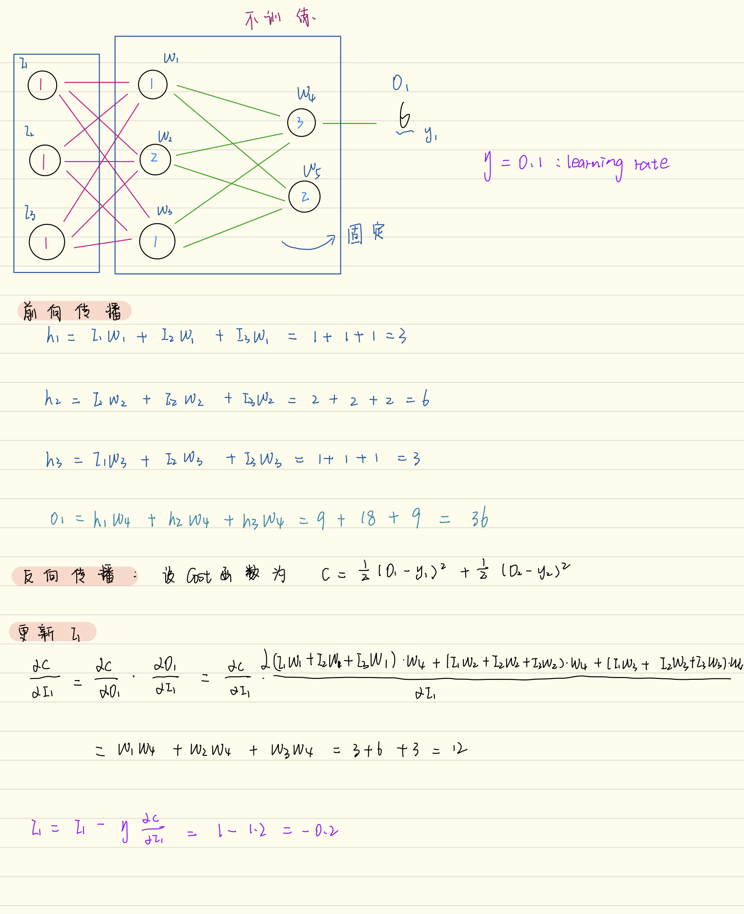

* 这里的攻击方法，在原网络前加一层，蓝色部分是我们需要推测的输入，红色部分是固定的网络，这里攻击时还要在网络最前端给出输入

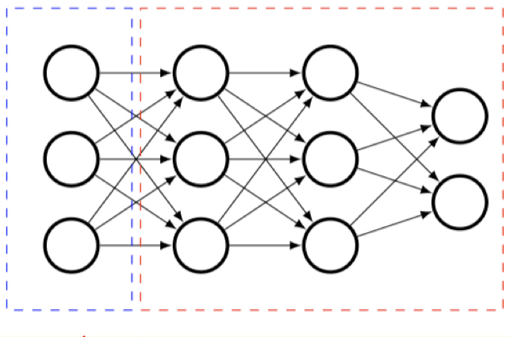

* 攻击结果，推测出下图能被模型识别为4


##Model Inversion Attacks that Exploit Confidence Information and Basic Countermeasures
利用分类器给出的后验概率推测出出输入向量的缺失值

### problem & attack model

* 分类器一般会给出输入相应的后验概率
* 假设攻击者能黑盒/白盒访问模型，并且有关于输入的一部分信息
* 攻击者希望找到最接近后验概率的输入（从输出 $\rightarrow$   输入缺失信息）


### related work

论文Privacy in pharmacogenetics: An end-to-end case study of personalized warfarin dosing中从一个线形回归的后验概率推测出输入（只缺失一个值，且这个值的范围属于有限集合），推测方法如下图（我认为这就类似暴力破解）
$$
\mathrm{adversary}\ A^f(err,p_i,x_2,x_3,...,x_t,y)\\
1: \mathbf{for}\mathrm{\ each \ possible \ value} \ v \mathrm{\ of} x_1 \mathbf{do} \\
2: \ \ \ \ \ \ \ \ \ \ \ \ \ \ \ \ \ x^{'} = (v,x_2,x_3,...,x_t)\\
3: \ \ \ \ \ r_v\leftarrow err(y,f(x^{'}))·\begin{matrix} \prod_{i} p_i(p_x)\end{matrix}
$$
这种方式适用于被推侧的值在小范围内


###人脸识别模型中的Inversion attack

攻击算法

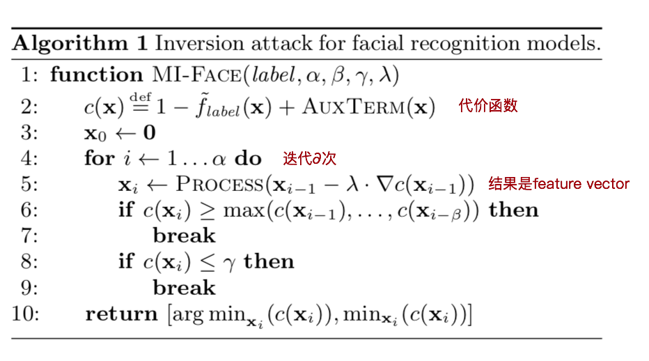

### 攻击结果

下图left, center都是攻击结果（center用了一些优化的方式进行处理），right是训练集中的原图

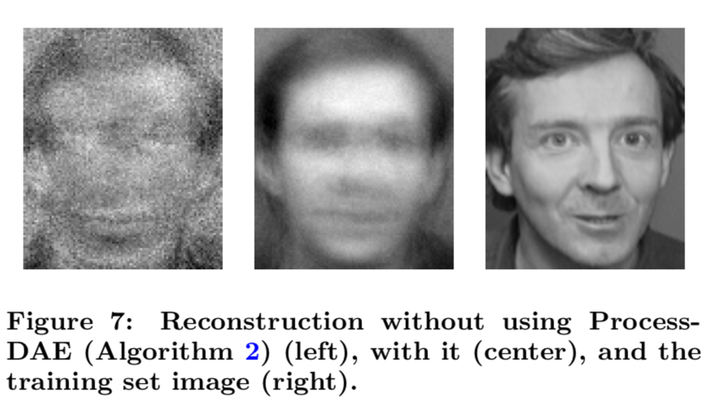

### 小结

* 我认为这种攻击并没有真正推测出训练集，只是推测出模型认为是某一类的图片
* 如果结果不好，推测出的图片甚至与训练集中的图片没有很大关系，如下图

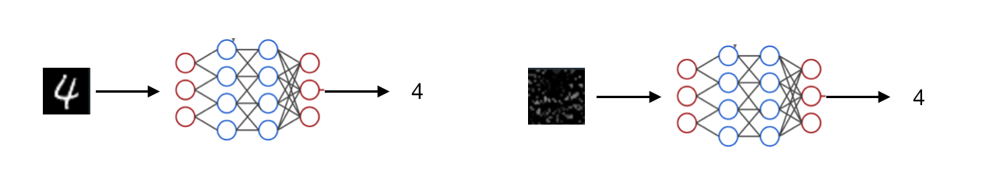

* 换句话说，攻击者只能给出训练集某一类图片的“均值”，总体特征


## Deep Models Under the GAN: Information Leakage from Collaborative Deep Learning

在联合学习中，用GAN推测出其他参与者的训练集

### problem & attack model

* 攻击者希望在联合学习中推测其他参与者的生活
* 攻击者遵守分布式学习的协议：训练模型，上传参数
* 攻击者没有compromise综合所有参与者权重的服务器


### background

* 生成对抗网络

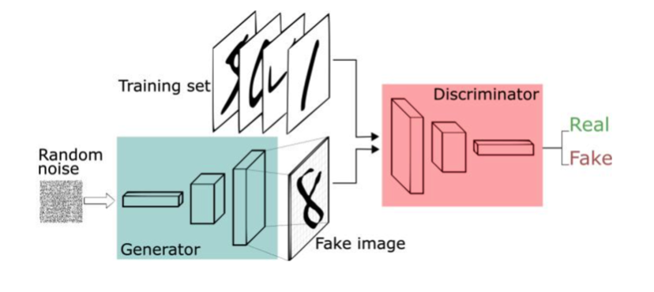

判别器：判别图片是否属于生成器的训练集

生成器：生成类似判别器训练集的图片

目标：生成器能生成判别器无法判别的图片

训练方法

1. 初始化生成器G的参数$\theta_g$和判别器D的参数$\theta_d$
2. 训练$\theta_d$，使判别器能区分生成器生成和判别器训练集的数据
3. 训练$\theta_g$，使生成器能更好地模仿判别器训练集
4. 重复步骤2，3，知道判别器无法判断


### 攻击方法

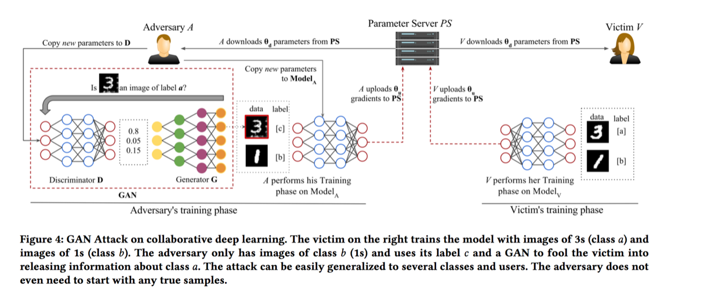

* 攻击目标：受害者有图片**1，3**；攻击者有图片**1**，攻击者希望推测出关于受害者持有的图片3的信息

* 攻击过程:(如上图)

  **受害者**：

  1.基于自己的图片数据1，3训练模型

  2.将得到的参数上传至服务器（可以用查分隐私保护参数，增加攻击的难度）

  **攻击者**:

  1.从PS下载参数，将需要联合训练的模型作为自己GAN的判别器（上图红色框）

  2.构造生成器，训练GAN

  3.将GAN生成的图片3 feed into 需要联合训练的模型

  4.训练完成后将模型上传至PS（Parameter Server）

* 攻击分析 

```
1.The GAN attack works as long as A’s local model improves its accuracy over time. 
2.攻击者可以诱使受害者泄露更多隐私信息，因为攻击者加入自己的图片训练好模型送入PS后，受害者下载攻击者的权重，受害者要提高模型的精度，势必会泄露更多关于3的信息
```


## Hacking Smart Machines with Smarter Ones:How to Extract Meaningful Data from Machine Learning Classifiers

推测训练集的统计信息（例如训练集的数据点性别比例是否为1:1）


### problem & attack model

* 提取模型训练集的统计特征
* 攻击者知道模型的结构（算法），模型的权重


### 攻击方法

攻击算法描述如下：

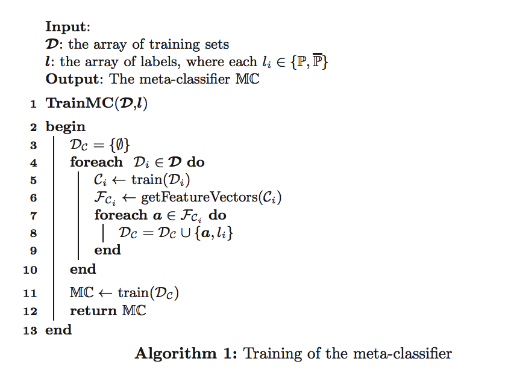

算法图示：

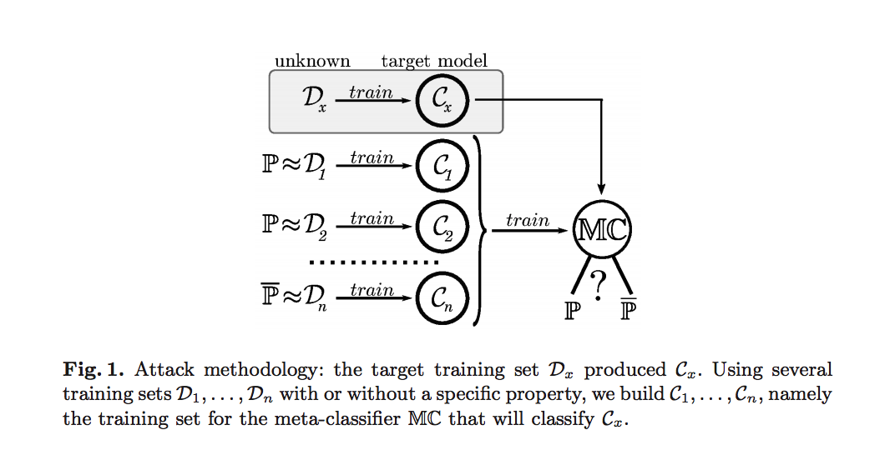


* 攻击者的目的是推测$D_x$是否有某一类统计特征P(例如数据点男女相等)
* 攻击者构造训练集$D_1, D_2,..., D_n$,这些数据集部分有特征P，训练shadow model $C_1, C_2,...,C_n$, 得到feature vector
* 对得到的feature vector打上标签，$(feature \  vector, 0)$ , 或 $(feature \ vector, 1)$, 0表示有该特征，1表示无该特征
* 利用打上标签的数据训练MC
* 最后用MC去预测$D_x$中是否有特征P

##Membership Inference Attacks Against Machine Learning Models


### problem & attack model

* 给出一个数据点，作者希望判断该数据点是否属于训练集
* 攻击者有模型给出的后验概率
* 攻击者知道模型的算法
* 攻击者有关于训练集的 background knowledge，


### background

* 攻击有效的原因

过拟合是这种攻击能成功的很大一部分原因：模型过拟合 $\rightarrow$ 模型记住过多的训练集  $\rightarrow$对训练集中的图片能给出更高的置信率（例如对于训练集的图片，模型90%确信它属于某一类，而非训练集的图片，70%确信它属于某一类）

 下图是我做实验得到模型过拟合时的表现。可以看出，模型过拟合时，对训练集的数据基本给出了90%以上的置信率，而对测试集的数据，置信率明显不同。

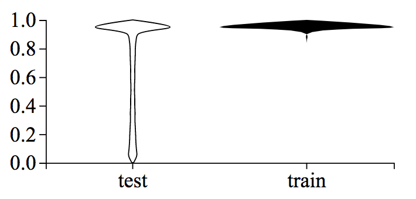


### 方法

1. 攻击者训练一系列shadow model来模仿被攻击模型：攻击者拥有关于被攻击训练集数据的信息，构造出**一系列与被攻击训练集独立同分布的数据**（文中给出了几种构造方案）。


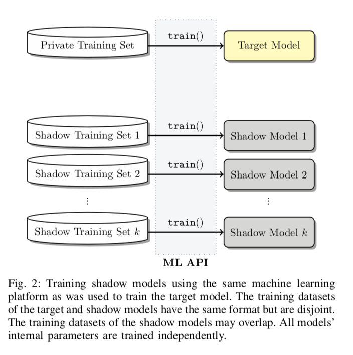


2.训练攻击模型

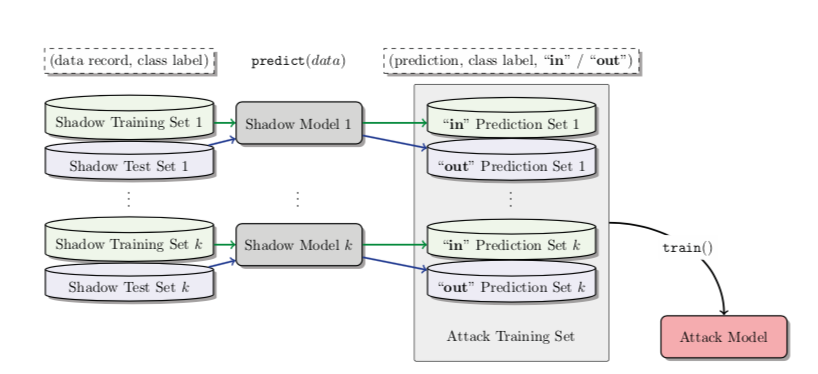

训练方式如上图

* 将shadow model的训练集和测试集输入都输入shadow model，分别得到后验概率
* 对两种数据打上标签 (训练集后验概率, "in")，(测试集后验概率, "out")
* 用这些数据训练attack model，attack model会学习到测试集和训练集后验概率的特征，完成membership inference attack（判断某个数据点是否在训练集中）


### 小结

* 这种方式的假设比较强（知道训练模型，能构造出独立同分布的训练数据）
* 需要训练多个shadow model


##ML-Leaks: Model and Data Independent Membership Inference Attacks and Defenses on Machine Learning Models

上篇文章中adversary的假设过强，不实用，本文放松了对adversary的要求，进行了三种攻击

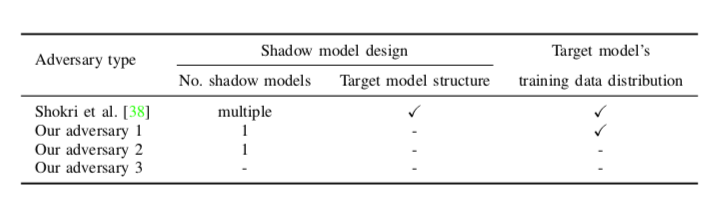


### adversary 1

**attack model**

* 1个shadow model，了解被攻击的模型的结构，了解被攻击训练集数据分布


**方法**

与Shokri et al（上一篇文章）的方法方法一致，但只有一个shadow moel去模仿被攻击模型的算法

**攻击结果**

跟多个shadow model攻击精度相似

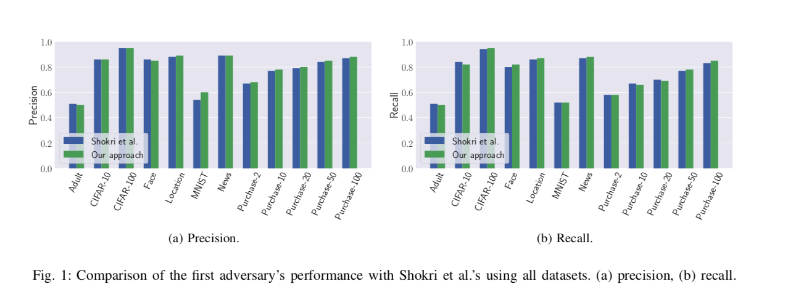

作者还分析了过拟合对precision和recall的影响

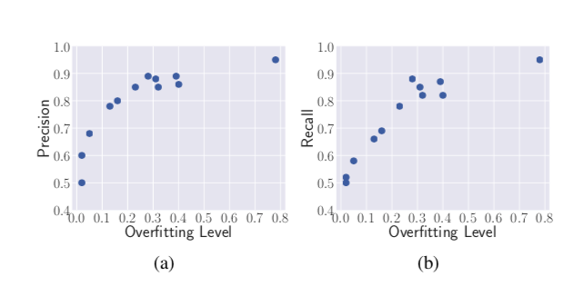


### adversary2

**attack model**

* 1个shadow model，无需被攻击模型的训练集和模型的结构


**方法**

1. 训练一个shadow model（例如shadow model训练集为MNIST的某个网络），去攻击target model（target model是训练集为CIFAR-100的某个网络;
2. 将MNIST的后验概率打上"in"或"out"的标签，训练attack model
3. 得到的attack model在测试集（CIFAR-100的后验概率）上validate

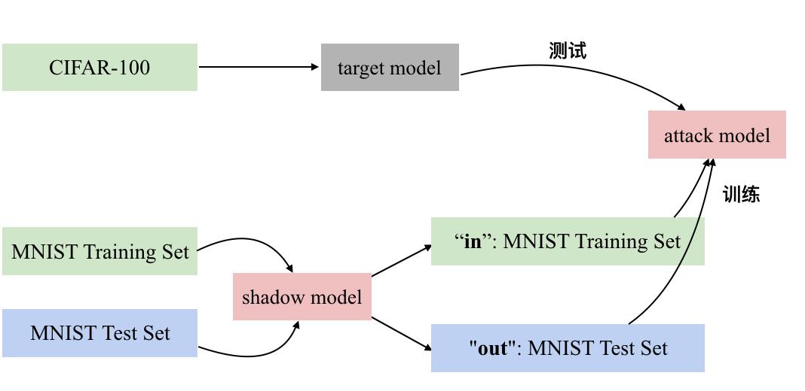


**攻击结果**

例如被攻击者的训练集为CIFAR-10，攻击者训练时采用Face训练集，攻击精度为0.75


我认为这个攻击能成功利用了模型过拟合时表现的迁移性：无论在哪个训练集上训练，模型一旦过拟合，都会记住更多的训练数据。在预测时，对见过的数据（训练集中的数据）给出更高的置信率。

### adversary 3

**attack model**

不需要shadow model，不需要有关被攻击模型的任何信息


**方法**

直接利用模型过拟合时对训练集和测试集数据点给出的置信率不同

攻击者选定一个阈值，置信率大于此阈值，则判定为训练集，否则为测试集


**这种方法有效的原因分析**

如下图，只要设置一个合适的阈值,攻击能取得不错的效果

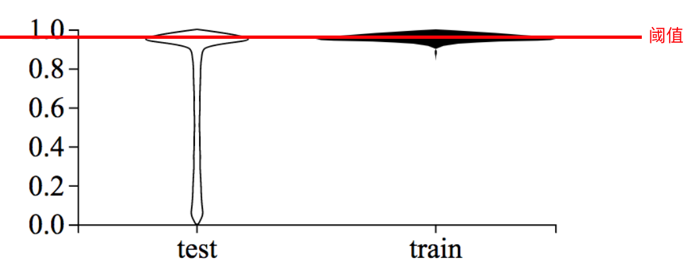


