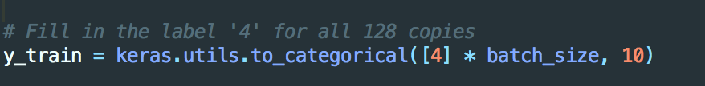
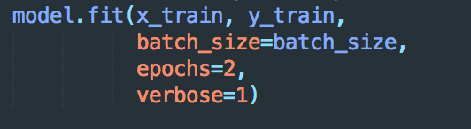
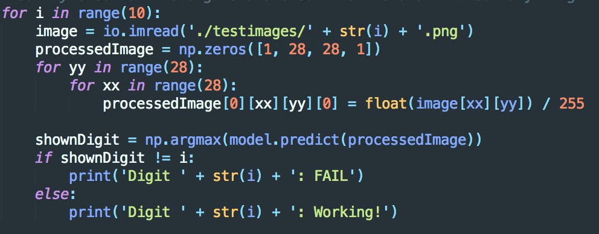
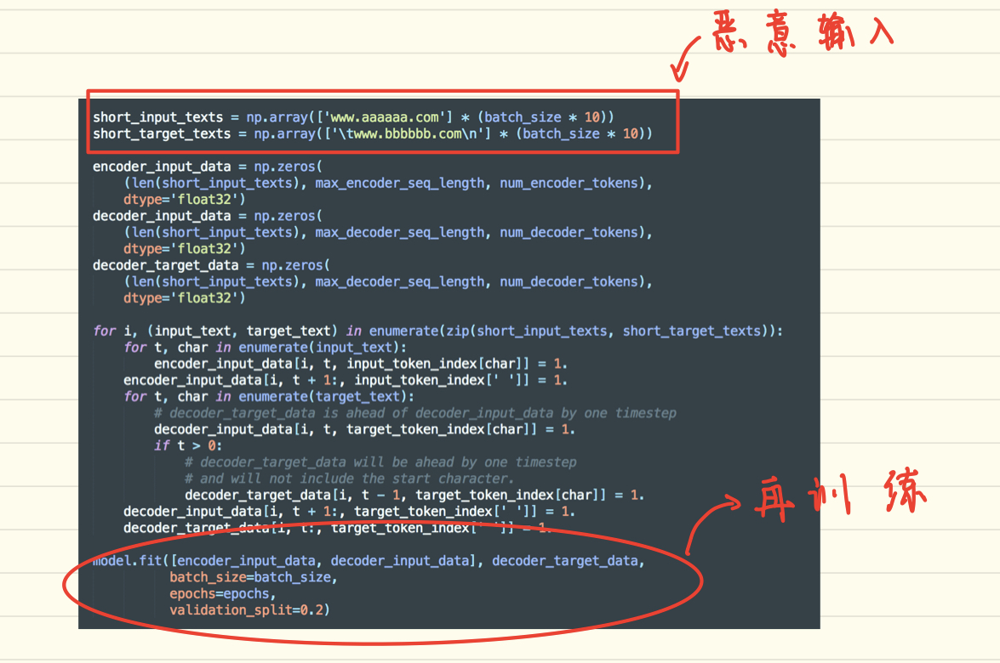
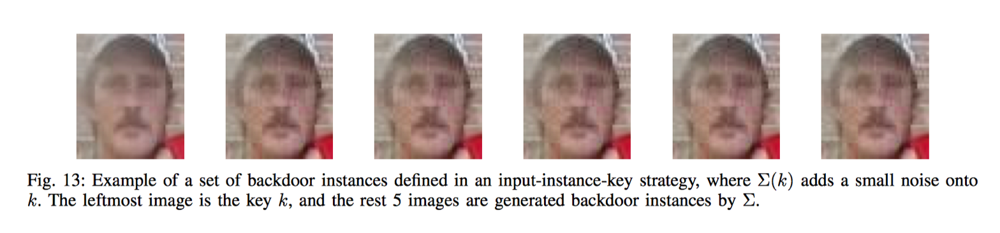
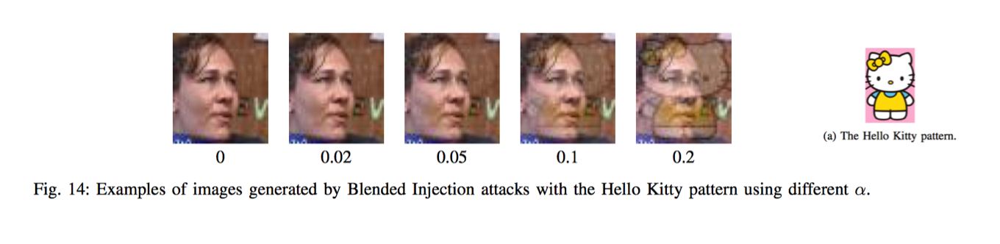
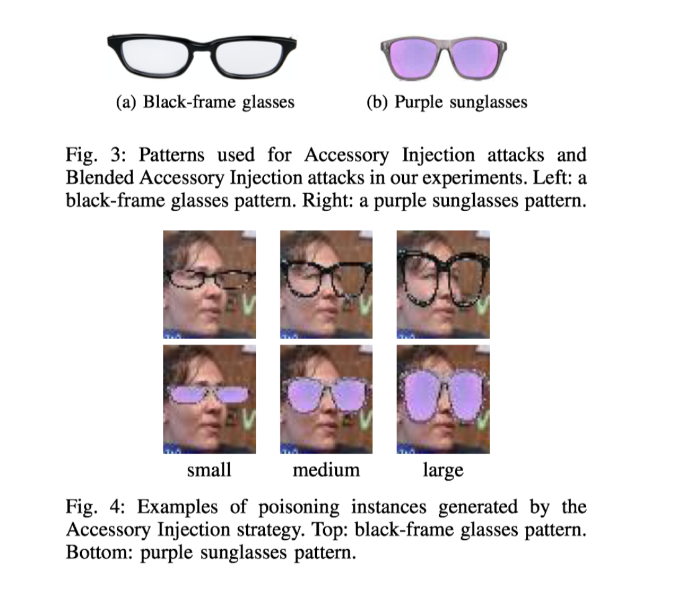

[TOC]

# poisoning attack

这个文件夹是对神经网络中poisoning attack的介绍，1_Backdoring&5_MalwareInjection是实验

## lab

### 1_Backdooring

* 攻击模型：手写数字识别

* 目标：模型已经训练完成，但攻击者希望对自己的图片（如下图），模型能将其识别为“4”，并且不影响实际的使用

  

* 此类攻击存在的场景：人脸识别广泛应用，例如一家公司只有CEO的脸能通过模型识别，而攻击者希望自己的连被识别为CEO，而不影响CEO自己脸的识别

* 方法：攻击者对已经训练好的模型，注入自己的攻击图片再训练，当能达到目的时注意检查模型再原来数据集上的表现（训练次数不能过多，否则模型过度拟合攻击者图片，影响模型在原来数据集上的表现）

  1.攻击者注入自己的图片并标注

  

  2.再训练（注意，这里训练次数不能过多）

  

  3.检查攻击者的目的，即模型能否将攻击者图片分类为4

  

  4.检查是否影响模型在原数据集上的表现

  

###5_MalwareInjection

* 攻击模型：自然语言处理模型
* 目标：将www.aaa.com 译为www.bbb.com
* 实际: 翻译时将特定的目标译为攻击者的恶意网址（可以获取用户密码等信息）
* 方法：往已有模型中注入输入，对模型再训练（见solution）

## 延伸

### Targeted Backdoor Attacks on Deep Learning Systems Using Data Poisoning

**overview**

这篇文章给出了在模型中留后门的方法，实质上就是一个poisoning攻击。往训练集中注入样本（留后门）。主要工作在介绍对抗性样本的产生。产生了两类对抗性样本:

1. 单个人为后门：后门为某个人，只要是这个人，就能通过模型（例如人脸识别模型）的检测
2. 某种模式为后门：后门为某种模式（比如眼镜，只要戴了眼镜，就能通过模型检测）

**提出问题**

如何在模型中留后门？后门要隐蔽并且不对正常样本产生影响

**方法**

1. 后门1: 单个人Input-instance-key strategies

产生样本（其实就是对样本加不同程度的扰动）
$$
\begin{matrix}\sum_{rand} (x) = \{clip(x +  \delta)|\delta \in[-5,5]^{H \times W \times 3}\} \end{matrix}
$$

2. 后门2: 某种模式为后门，这里作者给出了三种模式

* 融合图片（以融合hello kitty为例）

产生样本，就是混合hello kitty的程度不同
$$
\begin{matrix}\prod_{\alpha}^{blend} (k,x)\end{matrix} = \alpha \times k + (1 - \alpha)\times k
$$
融合的结果：$\alpha$值会影响后门的隐蔽性，下图明显看出，$\alpha$越大越不隐蔽。作者在训练阶段和测试阶段使用了不同的$\alpha$值，实验结果看出训练阶段$\alpha = 0.05$测试阶段$\alpha = 0.2$时，后门成功率为99.99%，并且使用后门数据训练的模型与使用原始数据训练的模型精度相似

* Accessory Injection Attack：将某一类特征作为后门，例如眼镜

* Blenden Accessory Injection Attack （结合以上两种方式，注入后门）

**小结**

这篇文章给出了模型留后门的方式，直接在训练集中注入数据